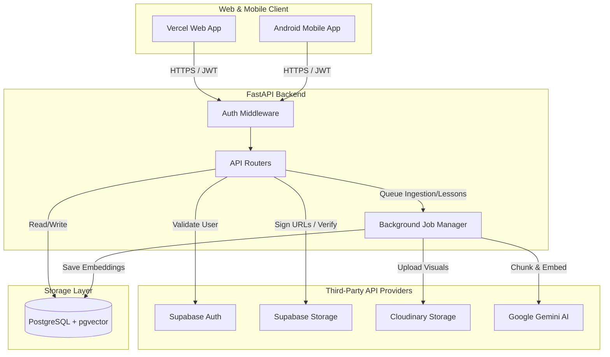
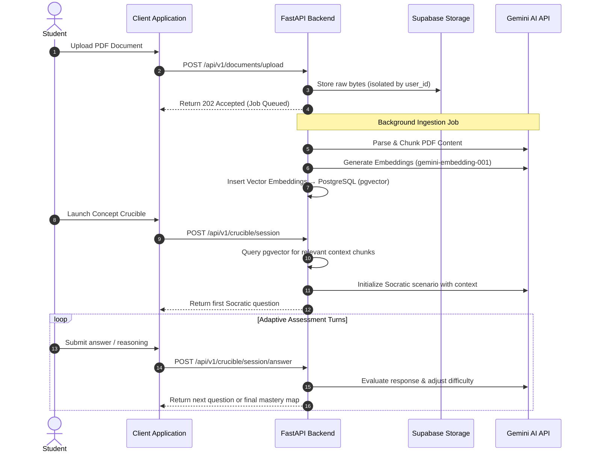

# 🌟 Lumina — AI-Powered Personalized Study & Assessment Platform

> *Transform your study materials into adaptive, intelligent learning experiences.*

[](https://fastapi.tiangolo.com/)
[](https://deepmind.google/technologies/gemini/)
[]()

---

## 🚀 The Problem

Self-directed learners drown in static content. Textbooks, research papers, and documentation don't adapt — they sit there, passive. Traditional quizzes reward memorization but fail to surface *where* your understanding actually breaks down.

**Lumina fixes this.** It turns any document into a living, responsive learning partner.

---

## 💡 What Lumina Does

Lumina ingests your study materials and gives you four powerful tools to engage with them:

| Feature | Description |
| --- | --- |
| 📄 **Document Ingestion** | Upload PDFs; Lumina chunks, embeds, and indexes them via pgvector for semantic retrieval |
| 📚 **Personalized Lessons** | Dynamically generated structured study modules tailored to your focus areas |
| 💬 **Explore Chat (RAG)** | Chat naturally with your documents — answers grounded strictly in *your* material |
| 🔥 **Concept Crucible** | Adaptive Socratic assessment engine that interviews you, challenges your reasoning, and maps your mastery |

---

## 🔥 Concept Crucible — The Star Feature

The **Concept Crucible** is Lumina's flagship innovation and the core of its hackathon value proposition.

Instead of a static multiple-choice quiz, Crucible conducts a **multi-turn Socratic dialogue** with the learner:

1. It retrieves the most semantically relevant chunks from your uploaded documents using pgvector.
2. It initializes an adaptive assessment scenario with Gemini 2.5 Flash.
3. As you respond, it evaluates your reasoning in real time and adjusts question difficulty.
4. At the end, it produces a **conceptual mastery map** — pinpointing exactly what you know and where your understanding breaks down.

This directly automates the **Feynman Technique** and **Socratic questioning** — two of the most evidence-backed active learning methods — and makes them accessible to anyone with a document to study.

---

## 🏗️ System Architecture



---

## 🔄 User Flow



---

## 🧰 Tech Stack

### Frontend (Web & Android — shared codebase)

- **React Native + Expo SDK 54** with TypeScript
- **Expo Router** — file-based navigation
- **Zustand** — lightweight state management with offline-first local caching
- **Axios** — JWT-aware API client with automatic token refresh

### Backend

- **FastAPI (Python 3.10)** — async-first, high-performance REST API
- **PostgreSQL (Supabase) + SQLAlchemy ORM**
- **pgvector** — 1536-dimensional semantic vector search
- **Background Job Manager** — in-memory worker pool for async ingestion and lesson generation
- **PyTest** — with SQLite schema emulation for isolated unit tests

### AI

- **Gemini 2.5 Flash** — structured generation, Socratic dialogue orchestration, concept extraction
- **gemini-embedding-001** — 1536-dim embeddings for semantic retrieval

### Infrastructure

- **Vercel** (Web), **Render** (FastAPI backend), **Supabase** (DB + Auth + Storage), **Cloudinary** (media), **EAS** (Android builds)

---

## 🔐 Security

- **Zero secret exposure** — No backend keys ever reach the client bundle or APK. All AI/storage calls are server-mediated.
- **Cross-user isolation** — Repository-layer RLS enforcement; attempting to access another user's documents returns `404`.
- **CORS lockdown** — Production origins explicitly restricted to verified Vercel domains.
- **Log redaction** — `RedactionFilter` scrubs passwords, API keys, JWT tokens, and bearer tokens from all stdout/production logs via regex.
- **Safe error surfacing** — Full traces logged server-side; clients receive only generic `500 Internal Error`.

---

## ⚙️ Local Development

### Prerequisites

- Python 3.10+
- Node.js 20+
- Docker (optional)

### 1. Start the Backend

```bash
cd server
python -m venv .venv
source .venv/bin/activate       # Windows: .venv\Scripts\activate
pip install -r requirements.txt
cp .env.template .env           # Fill in your credentials
uvicorn app.main:app --reload --host 0.0.0.0 --port 8000
```

### 2. Start the Client

```bash
cd ..
npm install
cp .env.example .env
# Uncomment: EXPO_PUBLIC_API_URL=http://localhost:8000
npm run start
# Press w → web browser | Press a → Android (Expo Go)
```

---

## 📦 Environment Variables

### Backend (`server/.env`)

```ini
DATABASE_URL=postgresql://postgres:<password>@db.<ref>.supabase.co:5432/postgres
PORT=8000
HOST=0.0.0.0
APP_ENV=production

SUPABASE_URL=https://<ref>.supabase.co
SUPABASE_ANON_KEY=<key>
SUPABASE_SERVICE_ROLE_KEY=<key>
SUPABASE_JWT_SECRET=<secret>

CLOUDINARY_CLOUD_NAME=<name>
CLOUDINARY_API_KEY=<key>
CLOUDINARY_API_SECRET=<secret>

GEMINI_API_KEY=<key>
```

### Client (`.env`)

```ini
EXPO_PUBLIC_API_URL=https://your-backend.onrender.com
```

---

## 🚢 Deployment

| Layer | Platform | Method |
| --- | --- | --- |
| Web Dashboard | Vercel | `npx expo export -p web` → `dist/` |
| FastAPI Backend | Render | Docker (`server/Dockerfile`) |
| Android App | EAS | `eas build --platform android --profile production` |
| Database | Supabase | Managed PostgreSQL + pgvector |

### Web (Vercel)

Set build command to `npx expo export -p web`, output directory to `dist`, and add `EXPO_PUBLIC_API_URL`.

### Android (EAS)

```bash
npm install -g eas-cli
eas login
eas build:configure
eas build --platform android --profile preview     # APK for testing
eas build --platform android --profile production  # AAB for Play Store
```

---

## 🔁 CI/CD

GitHub Actions (`.github/workflows/ci-cd.yml`) runs on every PR and push to `main`:

- **PR**: PyTest backend suite + TypeScript type check + static web export validation
- **Main**: Docker image build + production web asset build
- **Tags (`v*`)**: Automated EAS Android build and release trigger

---

## 🌍 Impact

Lumina democratizes two of the most powerful learning methods ever devised — the **Feynman Technique** and **Socratic questioning** — and automates them at scale via AI. The result: learners don't just passively scan pages. They engage in adaptive diagnostic conversations that surface exactly where their conceptual understanding breaks down, and guides them to true comprehension.

**Applications:** Student exam prep, employee onboarding, professional certification, research comprehension.

---

## 🔭 Future Roadmap

- **Video Scene Generation** — Connect the VEO backend integration to render animated concept explainers during lessons
- **Collaborative Study Rooms** — Multi-user Socratic assessment rooms via existing WebSocket infrastructure
- **Zotero / Mendeley Integration** — Direct academic paper import from reference managers

---

## 👤 Team

| Name | Role |
|---|---|
| **Angel Gupta** | Lead Developer & Architect |

---

## 📄 License

MIT License — see [LICENSE](LICENSE) for details.
